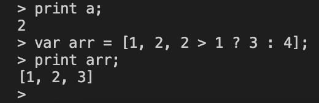
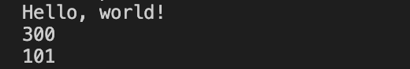

This is a interpreter based on AST syntax tree writed by dart language. It is a full-featured script language which named Dax. It can run Dax like language code. To experience the syntax features, run then following command in your terminal:

`dart run bin/lox.dart`

You can get result like this:



You can also specify a file as input, like this:

`dart run bin/lox.dart demo/fun.dax`

You can get result like this:




### 1.Basic Data Types：

* Interger 
```
var i = 1; 
```
* Float
```
var d = 1.0;
```
* Boolean
```
var t = true; 
var f = false;
```
* String
```
var s1 = "this is string enclosed by double quotes";  
var s2 = 'this is string enclosed by single quotes'; 
var s3 = '
this is 
multiline 
string which has three lines.
';
var s4 = "this is formated string, ${1+1} is the result of 1 + 1";
```
* List 
```
var arr = [1,2,3];
var arrIf = [1, if(2 > 1) 2 ,3]; // it returns [1, 2, 3]
var arrDict = [{"x": 1}, {"x": 2}];
```
* Map 
```
var dict = {"x": 1};
print dict["x"];
var compoDict = {"x": 1, "y": {"z": 2}};
```
* NULL
```
var n;
if (n == null) print "n is null"; 
```
### 2. Expressions
* Assignment 
```
var x = 1;
x = 2;
```
* And/OR 
```
var x = 2 > 1 and 2 < 3;
var x = 2 > 1 && 2 < 3; // it is also ok
var x = 2 > 1 or 2 < 3;
var x = 2 > 1 || 2 < 3; // it is also ok
```

* Ternary Operator
```
var x = 2 > 1 ? 2 : 3;
var x = 2 > 1 ? 3 > 2 ? 2 : 3 : 4; // it returns 2
```

* Comparison 
```
var x = 2 > 1;
```

* Arithmetic
```
var x = 1 + 2;
var y = 1 * 2 + 3 / 6;
```

* Logical
```
var x = -1;
var b = !true;
```

* Parentheses
```
var x = (1 + 2 )* ( 3 - 4 );
```

* Anonymous Function
```
var x = (i){ return i*2; };
var y = [1, 2, 3].map(x); // it returns [2, 4, 6]
```

* Interpolation
```
var s = "1+2 = ${1+2}"; // it returns 1+2 = 3
```

### 3. Statements
* If-Else
```
if (2 > 1) {
	print "2 is greater than 1";
} else {
	print "2 is not greater than 1";
}
```

* While Loop 
```
var i = 0;
while (i<10) {
	print i;
	i = i+1;
}
```
* For Loop
```
for (var i = 0; i< 10 ; i=i+1){
	print i;
}
```

* Return
```
fun add(x, y) {
	return x+y;
}
```

* Block
```
{
	var x = 1;
	var y = 2;
	print x + y;
}
```

### 4. Function
```
fun sayHello(name, {age = 20}) {
	print "Hello, My name is ${name}, age is ${age}"
}
sayHello("Tom");
sayHello("Jerry", age: 25)
```

### 5. Class 
```
class Person {
	sayHello() {
		print "hello, my name is ${name} and age is ${age}";
	}
}

class Student extends Person {
	study() {
		print "studying...";
	}
}
var p = Student();
p.name = "Tom";
p.age = 20;
p.sayHello();
p.study();
```